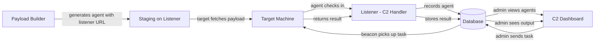
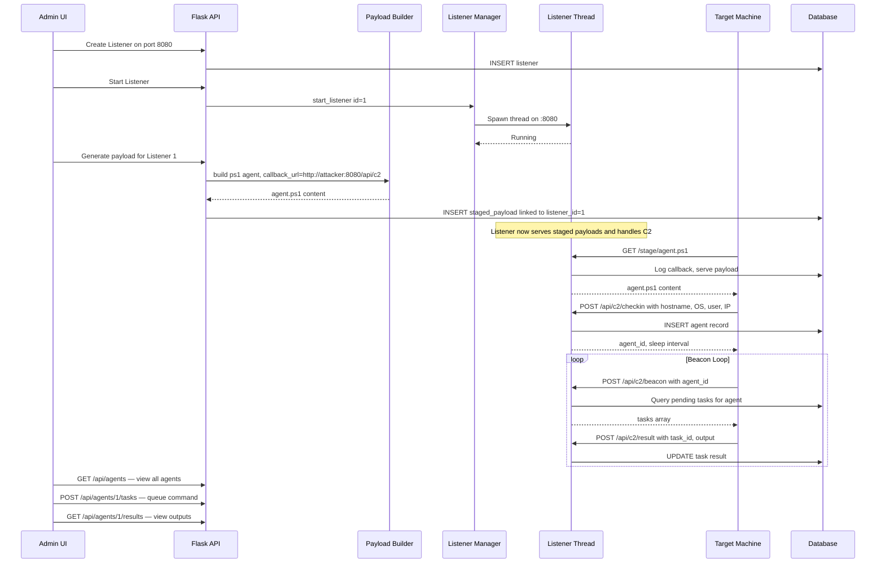
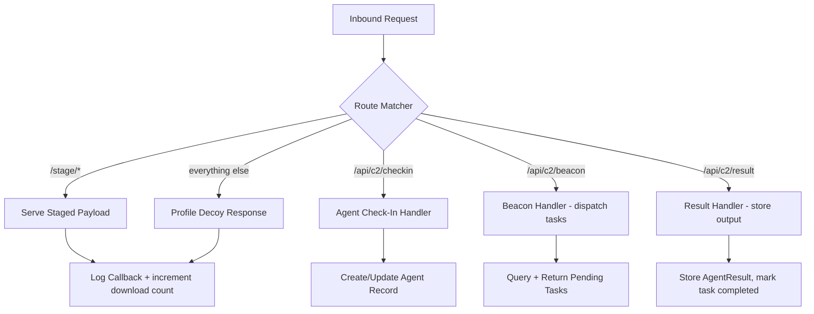
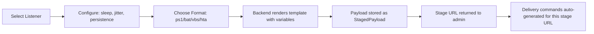

# Dynamic C2 Integration Plan — MalSharePoint

## 1. Problem Analysis

MalSharePoint currently has **five disconnected subsystems** that operate in isolation:

| Subsystem | Current State | Problem |
|-----------|--------------|---------|
| **File Hosting** | Static file serving on main Flask port | No connection to listeners or agents |
| **Payload Delivery** | Hardcoded one-liner generation | Commands use main app URL; no listener awareness |
| **Uploaded C2 Agents** | Manual .ps1/.bat/.vbs with hardcoded IPs | No dynamic generation; IPs/ports baked in at upload |
| **Honeypot C2 Endpoint** | Fake `/api/c2/checkin` returning 404 | No real C2 server; no agent tracking |
| **Audit Logging** | Flat action log | No structured callback/beacon/agent data |

### What the existing payload files reveal

Decoding the Base64 payloads in [`shell.bat`](../backend/uploads/e840fc165a014909be76666e46c65a6c_shell.bat:1) and [`payloadpers.ps1`](../backend/uploads/588e91db312e4746b06fa3e91c9659ba_payloadpers.ps1:1) shows they contain **full C2 agents** that:

1. Bypass AMSI via reflection
2. Check-in with system info: hostname, OS, username, IP
3. Run a beacon loop polling for tasks every 5 seconds
4. Execute received commands via `Invoke-Expression`  
5. Return results to the C2 server
6. The persistence variant writes a Run key to `HKCU\...\Run`

**But** — these agents point to hardcoded `http://192.168.1.21:6666/api/c2` and `http://192.168.1.21:4444/api`. There is **no backend to answer them**.

---

## 2. Vision: Seamless Pipeline

The goal is a fully integrated pipeline where every component dynamically feeds into the next:



**Key principles:**
- **Zero hardcoded values** — all IPs, ports, URLs derived from listener configuration
- **Dynamic payload generation** — select a listener, choose a format, get a ready payload
- **Automatic staging** — generated payloads auto-served by their assigned listener
- **Callback-to-agent correlation** — raw fetches and agent check-ins linked automatically
- **Unified dashboard** — agents, callbacks, listeners, and payloads in one view

---

## 3. Architecture Components

### 3.1 Data Flow Diagram



---

## 4. New Database Models

### 4.1 Agent Model

Tracks every unique implant that checks in.

| Column | Type | Description |
|--------|------|-------------|
| `id` | String 36, PK | UUID assigned at check-in |
| `hostname` | String 256 | Target computer name |
| `username` | String 256 | Logged-in user |
| `os_info` | String 512 | OS caption |
| `internal_ip` | String 45 | Targets LAN IP |
| `external_ip` | String 45 | Source IP seen by listener |
| `listener_id` | Integer, FK | Which listener received the check-in |
| `payload_id` | Integer, FK, nullable | Which generated payload was used |
| `sleep_interval` | Integer | Beacon interval in seconds, default 5 |
| `jitter` | Integer | Jitter percentage, default 10 |
| `status` | String 20 | `active`, `dormant`, `dead`, `disconnected` |
| `last_seen` | DateTime | Last beacon timestamp |
| `first_seen` | DateTime | Initial check-in timestamp |
| `metadata` | Text/JSON | Additional data: PID, arch, domain, etc. |

### 4.2 AgentTask Model

Commands queued for agents through the operator.

| Column | Type | Description |
|--------|------|-------------|
| `id` | String 36, PK | UUID |
| `agent_id` | String 36, FK | Target agent |
| `command` | Text | Command string to execute |
| `task_type` | String 32 | `shell`, `download`, `upload`, `sleep`, `kill`, `persist` |
| `status` | String 20 | `pending`, `sent`, `completed`, `failed` |
| `created_by` | Integer, FK | Admin who queued it |
| `created_at` | DateTime | When task was created |
| `sent_at` | DateTime, nullable | When delivered to agent |
| `completed_at` | DateTime, nullable | When result received |

### 4.3 AgentResult Model

Output/results returned by agents.

| Column | Type | Description |
|--------|------|-------------|
| `id` | Integer, PK | Auto-increment |
| `task_id` | String 36, FK | Which task this is a result for |
| `agent_id` | String 36, FK | Which agent produced it |
| `output` | Text | Command output |
| `success` | Boolean | Whether execution succeeded |
| `received_at` | DateTime | When the result was recorded |

### 4.4 StagedPayload Model

Dynamically generated payloads tied to listeners.

| Column | Type | Description |
|--------|------|-------------|
| `id` | Integer, PK | Auto-increment |
| `name` | String 128 | Human-readable name |
| `listener_id` | Integer, FK | Which listener serves this payload |
| `payload_type` | String 32 | `ps1_inmemory`, `ps1_persist`, `bat_wrapper`, `vbs_wrapper`, `hta` |
| `template_vars` | Text/JSON | Variables used: callback_url, sleep, jitter, etc. |
| `content` | Text | Generated payload content |
| `content_hash` | String 64 | SHA-256 of content |
| `stage_path` | String 256 | URL path on listener, e.g. `/stage/update.ps1` |
| `is_active` | Boolean | Whether listener should serve it |
| `download_count` | Integer | Times fetched |
| `created_by` | Integer, FK | Who generated it |
| `created_at` | DateTime | |

### 4.5 Listener, ListenerProfile, Callback

As designed in [`LISTENER_ARCHITECTURE.md`](./LISTENER_ARCHITECTURE.md:79) — no changes needed.

---

## 5. Listener WSGI App — Unified Handler

The listener thread WSGI app must handle **three distinct traffic types** on the same port:



### 5.1 Route Table per Listener

Each listener has configurable routes. Defaults:

| Pattern | Handler | Purpose |
|---------|---------|---------|
| `GET /stage/<path>` | `serve_staged_payload` | Deliver generated payloads |
| `POST /api/c2/checkin` | `handle_checkin` | New agent registration |
| `POST /api/c2/beacon` | `handle_beacon` | Return pending tasks to agent |
| `POST /api/c2/result` | `handle_result` | Receive command output |
| `GET /api/files/<id>/raw` | `serve_raw_file` | Serve uploaded files - same as main app |
| `*` | `decoy_response` | Return profile default page with fake Server header |

### 5.2 C2 Protocol

The C2 protocol matches the format already used by the existing uploaded agents:

**Check-In** — `POST /api/c2/checkin`
```json
{"hostname": "DESKTOP-ABC", "os": "Windows 10 Pro", "username": "john", "ip": "192.168.1.50"}
```
Response:
```json
{"agent_id": "uuid-here", "sleep": 5, "jitter": 10}
```

**Beacon** — `POST /api/c2/beacon`
```json
{"agent_id": "uuid-here"}
```
Response:
```json
{"tasks": [{"id": "task-uuid", "command": "whoami"}]}
```

**Result** — `POST /api/c2/result`
```json
{"agent_id": "uuid-here", "task_id": "task-uuid", "result": "desktop-abc\\john", "success": true}
```

This protocol is **backward-compatible** with the agents already uploaded to the system.

---

## 6. Dynamic Payload Builder

### 6.1 Template System

Instead of uploading pre-baked payloads, the builder generates them from templates with injected variables:

| Variable | Source | Description |
|----------|--------|-------------|
| `{{CALLBACK_URL}}` | Derived from listener bind address + port | Full C2 base URL |
| `{{STAGE_URL}}` | Listener stage path | Where the main agent is fetched from |
| `{{SLEEP}}` | User config, default 5 | Beacon interval in seconds |
| `{{JITTER}}` | User config, default 10 | Jitter percentage |
| `{{AMSI_BYPASS}}` | Auto-included for PS payloads | AMSI bypass block |
| `{{USER_AGENT}}` | Optional override | Custom User-Agent string |

### 6.2 Payload Formats

| Format | Extension | Description |
|--------|-----------|-------------|
| PowerShell In-Memory | `.ps1` | IEX cradle + beacon loop; never touches disk |
| PowerShell + Persistence | `.ps1` | Same + HKCU Run key with download cradle |
| BAT Launcher | `.bat` | Encoded PowerShell via batch wrapper |
| VBS Launcher | `.vbs` | VBS → ShellExecute → encoded PS |
| HTA Launcher | `.hta` | HTML Application with embedded PS execution |

### 6.3 Generation Flow



### 6.4 Obfuscation Layer

Each generation pass applies lightweight obfuscation:
- Random variable name generation — already present in existing payloads
- String concatenation for sensitive identifiers
- Base64 encoding of the PowerShell payload body
- Optional: XOR with embedded key for extra layer

---

## 7. Smart Delivery Integration

### 7.1 Listener-Aware Delivery Commands

The existing [`delivery_commands`](../backend/routes/files.py:242) endpoint becomes **listener-aware**:

```
GET /api/files/5/delivery?listener_id=1
```

When `listener_id` is provided:
- `raw_url` is built from the listeners bind_address + bind_port instead of the main app
- Staged payloads on that listener are included as additional delivery options
- One-liners reference the listener URL, not `localhost:5005`

### 7.2 Auto-Staging on Listener Start

When a listener starts:
1. All `StagedPayload` records linked to that `listener_id` with `is_active=True` become serveable
2. The listener WSGI app registers their `stage_path` routes
3. Admin sees which payloads are live on which listeners

### 7.3 Callback → Agent Correlation

When a listener serves a staged payload:
1. The `Callback` record stores the `staged_payload_id`
2. When the agent later checks in from the same source IP
3. The system auto-links the `Agent.payload_id` to the `StagedPayload`
4. The admin can trace: **payload generated → payload fetched → agent checked in → commands executed**

---

## 8. API Route Summary — New Endpoints

### 8.1 C2 Endpoints — On Listeners, unauthenticated

| Method | Path | Handler |
|--------|------|---------|
| `POST` | `/api/c2/checkin` | Agent check-in with system info |
| `POST` | `/api/c2/beacon` | Agent beacon, returns pending tasks |
| `POST` | `/api/c2/result` | Agent returns command output |

### 8.2 Agent Management — Admin-authenticated

| Method | Path | Description |
|--------|------|-------------|
| `GET` | `/api/agents` | List all agents with status |
| `GET` | `/api/agents/<id>` | Agent details |
| `POST` | `/api/agents/<id>/tasks` | Queue a command for agent |
| `GET` | `/api/agents/<id>/tasks` | List tasks for agent |
| `GET` | `/api/agents/<id>/results` | List results from agent |
| `PUT` | `/api/agents/<id>` | Update agent config: sleep, jitter |
| `DELETE` | `/api/agents/<id>` | Remove agent record |
| `POST` | `/api/agents/<id>/kill` | Queue self-destruct task |

### 8.3 Payload Builder — Admin-authenticated

| Method | Path | Description |
|--------|------|-------------|
| `GET` | `/api/payloads/templates` | List available payload templates |
| `POST` | `/api/payloads/generate` | Generate payload from template + listener |
| `GET` | `/api/payloads/staged` | List all staged payloads |
| `GET` | `/api/payloads/staged/<id>` | Get staged payload details |
| `PUT` | `/api/payloads/staged/<id>` | Toggle active/inactive |
| `DELETE` | `/api/payloads/staged/<id>` | Remove staged payload |
| `GET` | `/api/payloads/staged/<id>/delivery` | Delivery commands for this staged payload |

### 8.4 Listener Endpoints

As defined in [`LISTENER_ARCHITECTURE.md`](./LISTENER_ARCHITECTURE.md:206) — CRUD, lifecycle, profiles, callbacks.

---

## 9. Frontend Changes

### 9.1 New Pages

| Page | Route | Description |
|------|-------|-------------|
| **C2 Agents** | `/c2/agents` | Agent list with status, last seen, controls |
| **Agent Console** | `/c2/agents/:id` | Interactive shell — send commands, see output |
| **Payload Builder** | `/c2/payloads` | Generate payloads with listener + format selection |
| **Listeners** | `/c2/listeners` | Listener management — CRUD, start/stop |
| **Callbacks** | `/c2/callbacks` | Callback feed with filtering |

### 9.2 Navigation Update

Add a **C2** section to [`Layout.tsx`](../frontend/src/components/Layout.tsx:22) sidebar:

```
Main
  Dashboard
  Files
  Upload
  Payload Delivery

C2 Operations          ← NEW
  Agents               ← NEW
  Payload Builder      ← NEW
  Listeners            ← NEW
  Callbacks            ← NEW

Administration
  Overview
  Users
  Audit Logs
```

### 9.3 Enhanced PayloadDelivery Page

Update [`PayloadDelivery.tsx`](../frontend/src/pages/PayloadDelivery.tsx:104) to:
- Add listener selector dropdown
- When listener selected, delivery commands use listener URL
- Show staged payloads available on selected listener
- Add "Generate New Payload" button linking to Payload Builder

### 9.4 Admin Dashboard Enhancement

Update [`AdminDashboard.tsx`](../frontend/src/pages/admin/AdminDashboard.tsx:45) with:
- Active agents count
- Active listeners count
- Callbacks last 24h count
- Quick links to C2 pages

### 9.5 Real-Time Updates

For the C2 Agent Console and Callback feed:
- Polling every 2-3 seconds via React Query `refetchInterval`
- Future enhancement: WebSocket/SSE for instant updates

---

## 10. TypeScript Types — New Additions

```typescript
// Agents
interface Agent {
  id: string;
  hostname: string;
  username: string;
  os_info: string;
  internal_ip: string;
  external_ip: string;
  listener_id: number;
  payload_id: number | null;
  sleep_interval: number;
  jitter: number;
  status: 'active' | 'dormant' | 'dead' | 'disconnected';
  last_seen: string;
  first_seen: string;
}

interface AgentTask {
  id: string;
  agent_id: string;
  command: string;
  task_type: string;
  status: 'pending' | 'sent' | 'completed' | 'failed';
  created_at: string;
  sent_at: string | null;
  completed_at: string | null;
}

interface AgentResult {
  id: number;
  task_id: string;
  agent_id: string;
  output: string;
  success: boolean;
  received_at: string;
}

// Listeners
interface Listener {
  id: number;
  name: string;
  listener_type: 'http' | 'https';
  bind_address: string;
  bind_port: number;
  status: 'stopped' | 'starting' | 'running' | 'error';
  profile_id: number | null;
  active_agents: number;
  callback_count: number;
  created_at: string;
}

// Staged Payloads
interface StagedPayload {
  id: number;
  name: string;
  listener_id: number;
  payload_type: string;
  stage_path: string;
  is_active: boolean;
  download_count: number;
  created_at: string;
}
```

---

## 11. Configuration Additions

Add to [`Config`](../backend/config.py:5):

```python
# Listener defaults
LISTENER_CERTS_FOLDER = os.path.abspath(os.environ.get('CERTS_FOLDER') or 'certs')
MAX_LISTENERS = int(os.environ.get('MAX_LISTENERS', 10))
LISTENER_AUTO_START = os.environ.get('LISTENER_AUTO_START', 'true').lower() == 'true'

# C2 defaults
AGENT_DEAD_THRESHOLD_MINUTES = int(os.environ.get('AGENT_DEAD_THRESHOLD', 30))
DEFAULT_SLEEP_INTERVAL = int(os.environ.get('DEFAULT_SLEEP', 5))
DEFAULT_JITTER = int(os.environ.get('DEFAULT_JITTER', 10))

# Callback/retention
CALLBACK_RETENTION_DAYS = int(os.environ.get('CALLBACK_RETENTION_DAYS', 30))
CALLBACK_MAX_BODY_SIZE = int(os.environ.get('CALLBACK_MAX_BODY_KB', 512)) * 1024

# Payload templates
PAYLOAD_TEMPLATES_FOLDER = os.path.abspath(os.environ.get('TEMPLATES_FOLDER') or 'payload_templates')
```

---

## 12. File Structure — New and Modified Files

```
backend/
├── listeners/
│   ├── __init__.py                # NEW
│   ├── manager.py                 # NEW — ListenerManager singleton
│   ├── wsgi_app.py                # NEW — Unified WSGI app: staging + C2 + decoy
│   └── tls_utils.py               # NEW — TLS cert handling
├── c2/
│   ├── __init__.py                # NEW
│   ├── protocol.py                # NEW — C2 request/response handling
│   └── agent_tracker.py           # NEW — Agent status monitoring, dead detection
├── payloads/
│   ├── __init__.py                # NEW
│   ├── builder.py                 # NEW — Template rendering + obfuscation
│   └── templates/                 # NEW — Jinja2-style payload templates
│       ├── ps1_inmemory.py.j2     # NEW
│       ├── ps1_persist.py.j2      # NEW
│       ├── bat_launcher.bat.j2    # NEW
│       ├── vbs_launcher.vbs.j2    # NEW
│       └── hta_launcher.hta.j2    # NEW
├── routes/
│   ├── listeners.py               # NEW — Listener CRUD + lifecycle API
│   ├── callbacks.py               # NEW — Callback viewing API
│   ├── agents.py                  # NEW — Agent management API
│   ├── payload_builder.py         # NEW — Payload generation API
│   ├── files.py                   # MODIFIED — Add listener_id to delivery endpoint
│   └── admin.py                   # MODIFIED — Add C2 stats
├── models.py                      # MODIFIED — Add Agent, AgentTask, AgentResult, StagedPayload, Listener, etc.
├── config.py                      # MODIFIED — Add listener/C2/payload config
├── app.py                         # MODIFIED — Register new blueprints, init ListenerManager
├── certs/                         # NEW — TLS cert storage; gitignored

frontend/src/
├── pages/
│   ├── c2/
│   │   ├── Agents.tsx             # NEW — Agent list
│   │   ├── AgentConsole.tsx       # NEW — Interactive agent shell
│   │   ├── PayloadBuilder.tsx     # NEW — Payload generation UI
│   │   ├── Listeners.tsx          # NEW — Listener management
│   │   └── Callbacks.tsx          # NEW — Callback feed
│   ├── PayloadDelivery.tsx        # MODIFIED — Add listener selector
│   ├── admin/
│   │   └── AdminDashboard.tsx     # MODIFIED — Add C2 stats
├── api/
│   ├── agents.ts                  # NEW — Agent API client
│   ├── listeners.ts               # NEW — Listener API client
│   └── payloads.ts                # NEW — Payload builder API client
├── components/
│   └── Layout.tsx                 # MODIFIED — Add C2 nav section
├── types/
│   └── index.ts                   # MODIFIED — Add Agent, Listener, Payload types
└── App.tsx                        # MODIFIED — Add C2 routes
```

---

## 13. Implementation Phases

### Phase 1 — C2 Backend Foundation
1. Add `Agent`, `AgentTask`, `AgentResult` models to [`models.py`](../backend/models.py:1)
2. Create `backend/c2/protocol.py` — check-in, beacon, result handlers
3. Create `backend/c2/agent_tracker.py` — status monitoring, dead agent detection
4. Create `backend/routes/agents.py` — admin API for agent management
5. Update [`app.py`](../backend/app.py:1) to register agents blueprint

### Phase 2 — Listener Subsystem
6. Add `Listener`, `ListenerProfile`, `Callback` models to [`models.py`](../backend/models.py:1)
7. Create `backend/listeners/manager.py` — ListenerManager with start/stop/status
8. Create `backend/listeners/wsgi_app.py` — unified request handler for staging + C2 + decoy
9. Create `backend/routes/listeners.py` — listener CRUD + lifecycle + profiles
10. Create `backend/routes/callbacks.py` — callback viewing API
11. Update [`app.py`](../backend/app.py:1) — register blueprints, init ListenerManager, auto-start
12. Update [`config.py`](../backend/config.py:1) — add listener/C2 config

### Phase 3 — Dynamic Payload Generator
13. Create `backend/payloads/templates/` — all five payload templates
14. Create `backend/payloads/builder.py` — template engine with variable injection + obfuscation
15. Add `StagedPayload` model to [`models.py`](../backend/models.py:1)
16. Create `backend/routes/payload_builder.py` — generation API + staged payload management
17. Wire staged payloads into listener WSGI app — auto-serve active payloads

### Phase 4 — Smart Delivery Integration
18. Update [`delivery_commands`](../backend/routes/files.py:242) to accept `listener_id` parameter
19. Add callback → agent correlation logic in listener WSGI handler
20. Add auto-linking: staged payload download IP → agent check-in IP
21. Update [`admin.py`](../backend/routes/admin.py:109) stats to include C2 metrics
22. Seed default `ListenerProfile` records: Apache, IIS, Nginx

### Phase 5 — Frontend
23. Create `frontend/src/api/agents.ts`, `listeners.ts`, `payloads.ts`
24. Add TypeScript types for Agent, Listener, StagedPayload
25. Create `frontend/src/pages/c2/Agents.tsx` — agent list with status badges
26. Create `frontend/src/pages/c2/AgentConsole.tsx` — interactive command/response UI
27. Create `frontend/src/pages/c2/PayloadBuilder.tsx` — payload generation wizard
28. Create `frontend/src/pages/c2/Listeners.tsx` — listener management table
29. Create `frontend/src/pages/c2/Callbacks.tsx` — callback feed with filters
30. Update [`Layout.tsx`](../frontend/src/components/Layout.tsx:1) — add C2 Operations nav section
31. Update [`App.tsx`](../frontend/src/App.tsx:1) — add C2 routes
32. Update [`PayloadDelivery.tsx`](../frontend/src/pages/PayloadDelivery.tsx:1) — add listener selector
33. Update [`AdminDashboard.tsx`](../frontend/src/pages/admin/AdminDashboard.tsx:1) — add C2 stats cards

---

## 14. What becomes dynamic vs. what was static

| Before — Static | After — Dynamic |
|-----------------|-----------------|
| Hardcoded C2 URL in payload files | Builder injects listener URL at generation time |
| Delivery commands derive URL from request host | Commands use selected listeners bind address and port |
| One raw endpoint on main Flask port 5005 | Multiple listeners on configurable ports |
| No agent tracking | Full agent lifecycle: check-in → active → dormant → dead |
| Honeypot /api/c2/checkin returns 404 | Real C2 handler: check-in, beacon, result |
| Manual payload upload | Auto-generated from templates with obfuscation |
| Flat audit log | Structured callbacks, agent records, task history |
| No staging | Payloads auto-staged on listeners at configurable paths |
| File serving only from uploads/ | Staged payloads served from listener memory/DB |
| No correlation between download and callback | IP-based auto-linking: download → check-in → agent |

---

## 15. Dependencies

No new pip packages required beyond whats already installed:
- `werkzeug` — already a Flask dependency; used for `make_server`
- `threading`, `ssl`, `socket`, `uuid`, `json`, `base64` — all stdlib
- `Jinja2` — already a Flask dependency; used for payload templates

---

## 16. Security Considerations

1. **Listener isolation** — listener threads do NOT share Flask app context for request handling; they use standalone WSGI apps
2. **C2 endpoints are unauthenticated** — by design, targets cannot authenticate; listener WSGI apps skip JWT
3. **Admin endpoints remain JWT-protected** — all `/api/agents/*`, `/api/payloads/*`, `/api/listeners/*` require admin role
4. **Port restrictions** — cannot bind to main app port or privileged ports without root
5. **Callback body size limits** — configurable max body to prevent storage abuse
6. **Agent dead detection** — background thread marks agents `dead` after threshold exceeded
7. **Rate limiting on listeners** — optional per-listener request rate limit
