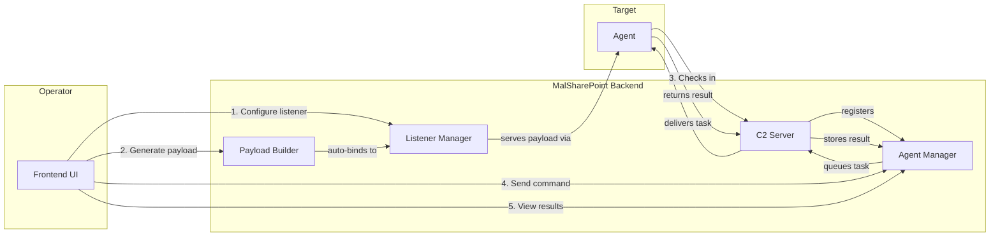
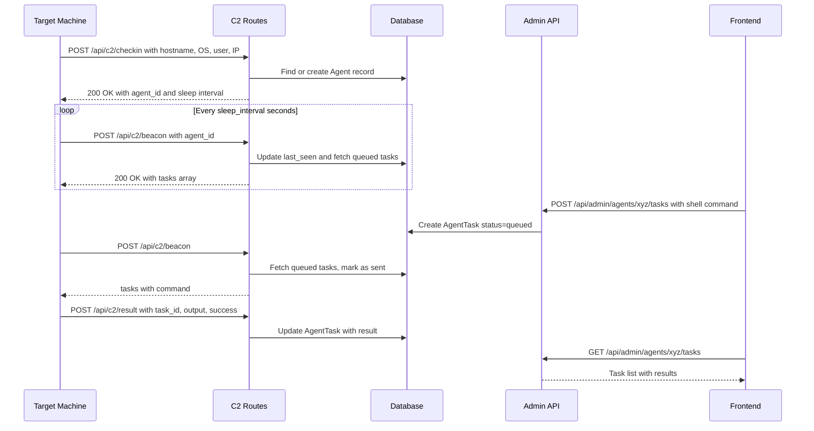
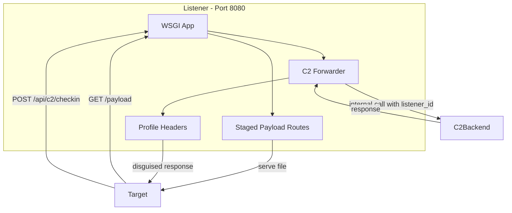
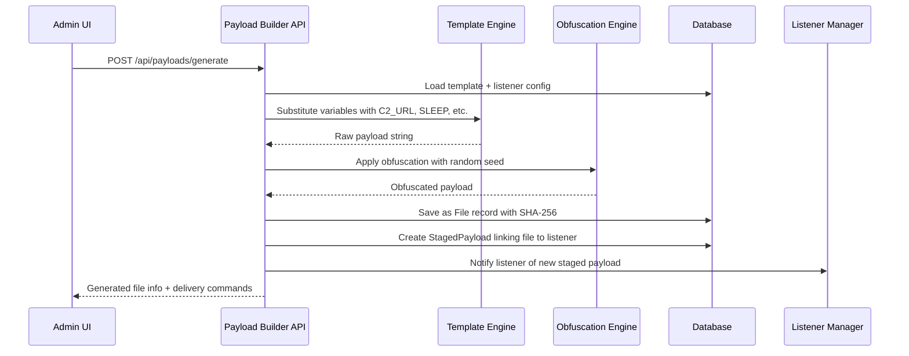
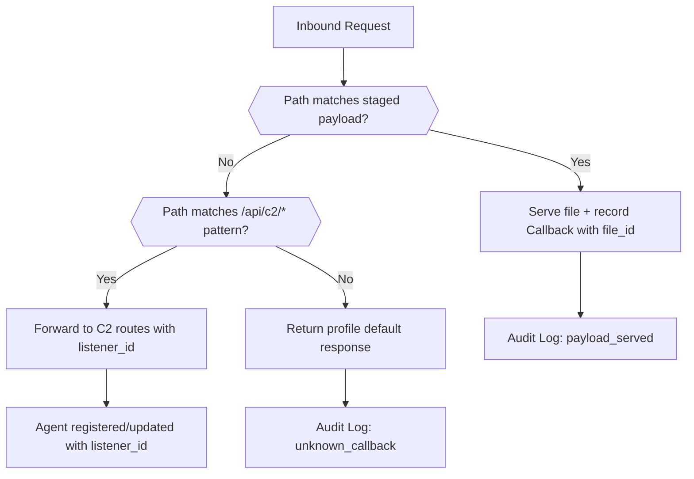

# Dynamic Integration Architecture — MalSharePoint

## 1. Executive Summary

This document defines the architecture for transforming MalSharePoint from a collection of loosely-coupled, static features into a **unified offensive operations platform** where Payloads, Listeners, C2 Agents, and Delivery mechanisms interact dynamically, seamlessly, and reliably.

### Core Problems Identified

| Area | Current State | Problem |
|------|---------------|---------|
| **C2** | Static honeypot at [`honeypot_c2`](../backend/app.py:47) returning 404 | No real C2 server; uploaded agents have no backend to talk to |
| **Agents** | Hardcoded IPs/ports in uploaded payloads like `shell.bat`, `payloadpers.ps1` | No agent registration, tracking, or task management |
| **Listeners** | Architecture plan exists in [`LISTENER_ARCHITECTURE.md`](./LISTENER_ARCHITECTURE.md) but nothing implemented | All traffic runs through main Flask port 5005 |
| **Payload Generation** | Manual file upload only; static delivery commands in [`delivery_commands`](../backend/routes/files.py:242) | No dynamic payload building; IPs/ports are baked into files |
| **Delivery** | One-liners use `request.host` as base URL | No listener-aware URL generation; no auto-staging |
| **Tracking** | [`AuditLog`](../backend/models.py:112) logs raw_fetch events generically | No callback→agent→payload chain; no situational awareness |

### Target State



---

## 2. Current Codebase Analysis

### 2.1 Uploaded Payload Reverse Engineering

Decoding the Base64 payloads in `backend/uploads/` reveals actual C2 agent implementations:

**`shell.bat` / `fun.vbs` — Lightweight C2 Agent:**
- AMSI bypass via `amsiInitFailed` reflection
- Checks in to `http://192.168.1.21:6666/api/c2/checkin` with hostname, OS, username, IP
- Beacon loop: every 5s POSTs to `/beacon` with `agent_id`
- Executes received `command` via `Invoke-Expression`, sends result to `/result`
- Uses `_req` helper function for all HTTP communication

**`payloadpers.ps1` — Persistent Agent:**
- Same AMSI bypass
- Adds **registry persistence** via `HKCU\...\Run` key pointing to a download cradle
- Registers at `http://192.168.1.21:4444/api/agents/register`
- Polls `GET /api/agents/{id}/tasks` for task queue
- Returns results to `POST /api/agents/{id}/results`
- Heartbeat via `POST /api/agents/{id}/heartbeat`

### 2.2 Implied C2 Protocol

Both agents expect these server-side endpoints:

| Endpoint | Method | Purpose |
|----------|--------|---------|
| `/api/c2/checkin` or `/api/agents/register` | POST | Agent registration with sysinfo |
| `/api/c2/beacon` or `/api/agents/{id}/tasks` | POST/GET | Poll for pending tasks |
| `/api/c2/result` or `/api/agents/{id}/results` | POST | Submit task execution results |
| `/api/agents/{id}/heartbeat` | POST | Keep-alive signal |

**None of these endpoints exist in the backend currently.** The only C2-related code is the honeypot at [`app.py:47`](../backend/app.py:47) which returns a fake 404.

### 2.3 Delivery System Gaps

The [`delivery_commands`](../backend/routes/files.py:242) endpoint:
- Derives `base_url` from `X-Base-URL` header or `request.host` — always the main app port
- Generates one-liners with hardcoded `raw_url` pattern `/api/files/{id}/raw`
- No awareness of listeners running on different ports
- No ability to customize obfuscation, encoding, or payload templates
- No staging concept — cannot link a specific payload to a specific listener for serving

---

## 3. Architecture: Five Integration Phases

### Phase 1: C2 Backend — The Brain

Build the real C2 server that the uploaded agent payloads expect.

#### 3.1.1 New Database Models

Add to [`models.py`](../backend/models.py):

**`Agent` model** — Tracks registered agents

| Column | Type | Description |
|--------|------|-------------|
| `id` | String 36, PK | UUID assigned at check-in |
| `hostname` | String 256 | Target machine name |
| `username` | String 256 | Logged-in user on target |
| `os_info` | String 512 | OS caption string |
| `internal_ip` | String 45 | IP reported by agent |
| `external_ip` | String 45 | IP from `request.remote_addr` |
| `listener_id` | Integer, FK, nullable | Which listener caught this agent |
| `payload_file_id` | Integer, FK, nullable | Which payload was used, if known |
| `status` | String 20 | `active`, `dormant`, `dead`, `disconnected` |
| `sleep_interval` | Integer | Beacon interval in seconds, default 5 |
| `jitter` | Integer | Jitter percentage, default 0 |
| `last_seen` | DateTime | Last beacon timestamp |
| `first_seen` | DateTime | Registration timestamp |
| `metadata` | Text/JSON | Extra sysinfo: PID, arch, privileges, etc. |

**`AgentTask` model** — Command queue

| Column | Type | Description |
|--------|------|-------------|
| `id` | String 36, PK | UUID |
| `agent_id` | String 36, FK | Target agent |
| `command` | Text | Command string to execute |
| `task_type` | String 32 | `shell`, `download`, `upload`, `sleep`, `kill`, `persist` |
| `status` | String 20 | `queued`, `sent`, `completed`, `failed` |
| `created_by` | Integer, FK | Admin who issued the task |
| `created_at` | DateTime | |
| `sent_at` | DateTime, nullable | When task was picked up by agent |
| `completed_at` | DateTime, nullable | |
| `result` | Text, nullable | Command output |
| `success` | Boolean, nullable | Whether execution succeeded |

#### 3.1.2 C2 API Routes — Agent-Facing

New blueprint: `c2_bp` at `/api/c2` — **NO authentication** since agents cannot carry JWTs.

These routes implement both protocol variants found in the uploaded payloads:

```
POST /api/c2/checkin          — Agent registration
POST /api/c2/beacon           — Poll for tasks + heartbeat
POST /api/c2/result           — Submit task result
POST /api/agents/register     — Alias for checkin, persistent agent variant
GET  /api/agents/{id}/tasks   — Alias for beacon, persistent agent variant
POST /api/agents/{id}/results — Alias for result, persistent agent variant
POST /api/agents/{id}/heartbeat — Keep-alive
```

**Smart agent identification:** On checkin, the C2 server:
1. Checks if an agent with the same hostname + username + internal_ip already exists
2. If yes: reuses the agent ID + updates `last_seen` and `external_ip` — avoids duplicate registrations
3. If no: creates a new agent with a fresh UUID
4. Optionally correlates with a `listener_id` if the request came through a listener

**Automatic status management:**
- `last_seen` updated on every beacon
- Background job marks agents as `dormant` after 3× sleep_interval without beacon
- Marks as `dead` after 10× sleep_interval

#### 3.1.3 Agent Management API — Admin-Facing

New blueprint: `agents_bp` at `/api/admin/agents`, admin-only.

| Method | Path | Description |
|--------|------|-------------|
| `GET` | `/api/admin/agents` | List all agents with filtering and status |
| `GET` | `/api/admin/agents/{id}` | Agent details with task history |
| `POST` | `/api/admin/agents/{id}/tasks` | Queue a command for the agent |
| `GET` | `/api/admin/agents/{id}/tasks` | List all tasks for an agent |
| `DELETE` | `/api/admin/agents/{id}` | Remove agent record |
| `POST` | `/api/admin/agents/{id}/sleep` | Change beacon interval |
| `POST` | `/api/admin/agents/{id}/kill` | Queue self-destruct task |

#### 3.1.4 Integration Flow



---

### Phase 2: Listener Subsystem — The Ears

Implement the architecture from [`LISTENER_ARCHITECTURE.md`](./LISTENER_ARCHITECTURE.md) with key additions for C2 integration.

#### 3.2.1 Key Enhancement: Listeners as C2 Frontends

Each listener WSGI app will:
1. **Serve staged payloads** — Files linked to the listener are served at custom paths
2. **Proxy C2 traffic** — Forward `/api/c2/*` requests to the main C2 backend, adding `listener_id` context
3. **Record all callbacks** — Every inbound request creates a `Callback` record
4. **Apply response profile** — Use `ListenerProfile` headers to disguise as Apache/IIS/Nginx



#### 3.2.2 Staging System

New model addition to listener infrastructure:

**`StagedPayload` model** — Links files to listeners with custom paths

| Column | Type | Description |
|--------|------|-------------|
| `id` | Integer, PK | |
| `listener_id` | Integer, FK | Which listener serves this |
| `file_id` | Integer, FK | Which file to serve |
| `serve_path` | String 256 | Custom URL path, e.g. `/update.exe` or `/jquery.js` |
| `auto_generated` | Boolean | Whether this was auto-created by the payload builder |
| `serve_count` | Integer | How many times it was fetched |
| `created_at` | DateTime | |

This means:
- A listener on port 8080 can serve `shell.bat` at `http://target:8080/update.exe`
- The payload builder can auto-stage generated payloads on the selected listener
- Callback records link back to both the listener and the staged payload

#### 3.2.3 Implementation Files

```
backend/
├── listeners/
│   ├── __init__.py
│   ├── manager.py           # ListenerManager singleton
│   ├── wsgi_app.py           # WSGI app with staging + C2 forwarding
│   └── tls_utils.py          # TLS cert helpers
├── routes/
│   ├── listeners.py          # Listener CRUD + lifecycle
│   └── callbacks.py          # Callback viewing
```

---

### Phase 3: Dynamic Payload Generator — The Arsenal

Replace static file uploads with an intelligent payload builder that generates agents configured for specific listeners.

#### 3.3.1 Payload Template System

**`PayloadTemplate` model**

| Column | Type | Description |
|--------|------|-------------|
| `id` | Integer, PK | |
| `name` | String 128 | e.g. *PowerShell C2 Agent*, *BAT Dropper + Agent*, *VBS Launcher* |
| `description` | Text | |
| `template_type` | String 32 | `ps1`, `bat`, `vbs`, `hta`, `exe_dropper` |
| `template_content` | Text | Template with `{{PLACEHOLDER}}` variables |
| `variables` | Text/JSON | List of available template variables with defaults |
| `supports_obfuscation` | Boolean | |
| `supports_persistence` | Boolean | |
| `is_builtin` | Boolean | System-provided vs user-defined |
| `created_by` | Integer, FK | |
| `created_at` | DateTime | |

#### 3.3.2 Template Variables

Templates use Jinja2-style placeholders that are filled by the builder:

| Variable | Source | Description |
|----------|--------|-------------|
| `{{C2_URL}}` | Auto from listener | Full URL to C2 endpoint, e.g. `http://10.0.0.5:8080/api/c2` |
| `{{CALLBACK_HOST}}` | Auto from listener | Listener host/IP |
| `{{CALLBACK_PORT}}` | Auto from listener | Listener port |
| `{{SLEEP_INTERVAL}}` | User configurable | Beacon interval in seconds |
| `{{JITTER}}` | User configurable | Jitter percentage |
| `{{USER_AGENT}}` | User configurable | Custom User-Agent string |
| `{{PAYLOAD_URL}}` | Auto from staging | URL where the payload itself is staged |
| `{{OBFUSCATION_SEED}}` | Auto-generated | Random seed for variable name obfuscation |
| `{{PERSISTENCE_KEY}}` | User configurable | Registry key name for persistence |

#### 3.3.3 Built-in Templates

Extracted and generalized from the existing uploaded payloads:

1. **PowerShell C2 Agent** — Based on `shell.bat` inner payload
   - AMSI bypass, check-in, beacon loop, command execution
   - Template variables: `{{C2_URL}}`, `{{SLEEP_INTERVAL}}`, `{{JITTER}}`

2. **PowerShell Persistent Agent** — Based on `payloadpers.ps1`
   - All of above + registry run key persistence
   - Additional variable: `{{PERSISTENCE_KEY}}`, `{{PAYLOAD_URL}}`

3. **VBS Launcher** — Based on `fun.vbs`
   - Wraps any PowerShell payload in a VBS shellexecute
   - Variable: `{{INNER_PAYLOAD_B64}}` auto-generated from a PS template

4. **BAT Dropper** — Wraps the encoded PowerShell command in a BAT launcher

5. **HTA Launcher** — HTML Application wrapper for execution via `mshta`

#### 3.3.4 Obfuscation Engine

Replaces the current hardcoded random variable names with systematic obfuscation:

| Technique | Description |
|-----------|-------------|
| **Variable renaming** | Replace function/variable names with random strings using `{{OBFUSCATION_SEED}}` |
| **String encoding** | Convert strings to char-code arrays, already used in existing payloads |
| **Base64 layering** | Wrap final payload in `-Enc` parameter |
| **Whitespace randomization** | Add random whitespace and line breaks |
| **Comment injection** | Inject harmless comments to vary hash |

Each generation produces a **unique hash**, so even the same template + config yields different files.

#### 3.3.5 Payload Builder API

New blueprint: `payloads_bp` at `/api/payloads`, admin-only.

| Method | Path | Description |
|--------|------|-------------|
| `GET` | `/api/payloads/templates` | List available templates |
| `GET` | `/api/payloads/templates/{id}` | Get template details with available variables |
| `POST` | `/api/payloads/generate` | Generate a payload from template + config |
| `GET` | `/api/payloads/generated` | List previously generated payloads |
| `DELETE` | `/api/payloads/generated/{id}` | Delete a generated payload |

**`POST /api/payloads/generate` request:**
```json
{
  "template_id": 1,
  "listener_id": 3,
  "config": {
    "sleep_interval": 10,
    "jitter": 20,
    "persistence": true,
    "obfuscation": true,
    "user_agent": "Mozilla/5.0..."
  },
  "auto_stage": true,
  "stage_path": "/jquery-3.6.min.js"
}
```

**What happens automatically:**
1. Template loaded from DB
2. `{{C2_URL}}` resolved from listener 3s bind address/port
3. All variables substituted
4. Obfuscation applied if enabled
5. Payload saved as a new `File` record with description and tags
6. If `auto_stage=true`: creates a `StagedPayload` on listener 3 at the given path
7. Returns the generated file info + delivery commands for that listener



---

### Phase 4: Smart Delivery Integration — The Glue

Make delivery commands, listeners, and payloads work as a single unit.

#### 3.4.1 Listener-Aware Delivery Commands

Update [`delivery_commands`](../backend/routes/files.py:242) to:

1. Accept optional `listener_id` query parameter
2. When provided: use listener `bind_address:bind_port` as base URL
3. Support custom `serve_path` from `StagedPayload` instead of generic `/api/files/{id}/raw`
4. Add listener-specific delivery techniques based on the staging path

**Example:** If a payload is staged on listener 3 at port 8080 as `/jquery-3.6.min.js`:
- `raw_url` becomes `http://10.0.0.5:8080/jquery-3.6.min.js`
- All one-liners use this URL
- The path looks benign in logs

#### 3.4.2 Auto-Staging on Listener Start

When a listener starts:
1. Check for any `StagedPayload` records linked to it
2. Load them into the WSGI apps route table
3. Log a `listener_stage` audit event

When a new `StagedPayload` is created for a running listener:
1. **Hot-reload** the route into the running WSGI app without restart

#### 3.4.3 Callback-to-Agent Chain

When a listener receives a request:



This creates a complete chain: **Listener** → **Callback** → **Agent** → **Task** → **Result**, all linked by foreign keys.

#### 3.4.4 Unified Event Stream

Introduce a lightweight event system so all components can react to each other:

| Event | Emitted By | Consumed By |
|-------|-----------|-------------|
| `listener.started` | ListenerManager | Dashboard stats, auto-stage loader |
| `listener.stopped` | ListenerManager | Agent status checker |
| `listener.callback` | Listener WSGI | Callback DB writer, audit log |
| `agent.registered` | C2 routes | Dashboard notification |
| `agent.beacon` | C2 routes | Agent status updater, task dispatcher |
| `agent.result` | C2 routes | Task status updater, UI notification |
| `payload.generated` | Payload builder | Auto-stager, file list refresh |
| `payload.served` | Listener WSGI | Callback tracker, download counter |

Implementation: Simple in-process event bus using Python signals/callbacks. For the frontend, expose a `GET /api/events/stream` SSE endpoint for real-time updates.

---

### Phase 5: Frontend — The Control Surface

#### 3.5.1 New Pages

| Page | Route | Description |
|------|-------|-------------|
| **Listeners** | `/admin/listeners` | Listener CRUD, start/stop, status badges, staged payload list |
| **Callbacks** | `/admin/callbacks` | Callback feed with filters, detail drawer, timeline chart |
| **Agents** | `/agents` | Agent list with status, last seen, task history |
| **Agent Interact** | `/agents/{id}` | Command input, result output, agent details |
| **Payload Builder** | `/payload-builder` | Template selection, configuration, listener binding, generate button |

#### 3.5.2 Enhanced Existing Pages

**[`PayloadDelivery`](../frontend/src/pages/PayloadDelivery.tsx:104):**
- Add listener dropdown selector
- When listener selected: `raw_url` uses listener address/port
- Show staging path if payload is staged on that listener
- Visual indicator: payload → listener → agent flow

**[`AdminDashboard`](../frontend/src/pages/admin/AdminDashboard.tsx:45):**
- Add stat cards: Active Listeners, Active Agents, Total Callbacks
- Quick links to Listeners and Agents pages

**[`Dashboard`](../frontend/src/pages/Dashboard.tsx:50):**
- Add live agent feed: new check-ins, recent results
- Add listener status strip

**[`Layout`](../frontend/src/components/Layout.tsx:22):**
- Add nav items: Listeners, Agents, Payload Builder, Callbacks
- Reorganize: Main section for operations, Admin section for management

#### 3.5.3 Real-Time Updates

Use Server-Sent Events for:
- New agent check-ins → notification badge on Agents nav item
- Task results → live update in agent interact view
- Listener status changes → status badge updates
- Callback feed → auto-scroll in callback dashboard

#### 3.5.4 New Types

Add to [`types/index.ts`](../frontend/src/types/index.ts):

```typescript
interface Agent {
  id: string
  hostname: string
  username: string
  os_info: string
  internal_ip: string
  external_ip: string
  listener_id: number | null
  status: 'active' | 'dormant' | 'dead' | 'disconnected'
  sleep_interval: number
  jitter: number
  last_seen: string
  first_seen: string
}

interface AgentTask {
  id: string
  agent_id: string
  command: string
  task_type: string
  status: 'queued' | 'sent' | 'completed' | 'failed'
  created_at: string
  sent_at: string | null
  completed_at: string | null
  result: string | null
  success: boolean | null
}

interface Listener {
  id: number
  name: string
  listener_type: 'http' | 'https'
  bind_address: string
  bind_port: number
  status: 'stopped' | 'starting' | 'running' | 'error'
  profile_id: number | null
  created_at: string
  callback_count: number
  staged_payloads: number
}

interface Callback {
  id: number
  listener_id: number
  source_ip: string
  user_agent: string
  request_method: string
  request_path: string
  file_id: number | null
  timestamp: string
}

interface PayloadTemplate {
  id: number
  name: string
  description: string
  template_type: string
  variables: TemplateVariable[]
  supports_obfuscation: boolean
  supports_persistence: boolean
}
```

---

## 4. File Structure — All New/Modified Files

```
backend/
├── app.py                        # MODIFIED: register new blueprints, init ListenerManager + event bus
├── models.py                     # MODIFIED: add Agent, AgentTask, Listener, ListenerProfile,
│                                 #           Callback, StagedPayload, PayloadTemplate models
├── config.py                     # MODIFIED: add listener + C2 config entries
├── events.py                     # NEW: in-process event bus
├── c2/
│   ├── __init__.py               # NEW
│   └── routes.py                 # NEW: C2 agent-facing routes, checkin/beacon/result
├── listeners/
│   ├── __init__.py               # NEW
│   ├── manager.py                # NEW: ListenerManager singleton
│   ├── wsgi_app.py               # NEW: WSGI app with staging + C2 forwarding
│   └── tls_utils.py              # NEW: TLS helpers
├── payloads/
│   ├── __init__.py               # NEW
│   ├── builder.py                # NEW: Payload generation engine
│   ├── obfuscator.py             # NEW: Obfuscation engine
│   └── templates/                # NEW: Built-in payload template files
│       ├── ps1_agent.py          # NEW: PowerShell C2 agent template
│       ├── ps1_persistent.py     # NEW: PowerShell persistent agent template
│       ├── vbs_launcher.py       # NEW: VBS launcher template
│       ├── bat_dropper.py        # NEW: BAT dropper template
│       └── hta_launcher.py       # NEW: HTA launcher template
├── routes/
│   ├── files.py                  # MODIFIED: add listener_id param to delivery_commands
│   ├── listeners.py              # NEW: Listener CRUD + lifecycle API
│   ├── callbacks.py              # NEW: Callback viewing API
│   ├── agents.py                 # NEW: Agent management API, admin-only
│   ├── payloads.py               # NEW: Payload builder API
│   └── events.py                 # NEW: SSE event stream endpoint
├── certs/                        # NEW: TLS cert storage, gitignored
├── tasks/
│   ├── __init__.py               # NEW
│   └── agent_watchdog.py         # NEW: Background task for agent status management

frontend/src/
├── App.tsx                       # MODIFIED: add new routes
├── components/
│   └── Layout.tsx                # MODIFIED: add nav items for Listeners, Agents, Payload Builder
├── api/
│   ├── listeners.ts              # NEW: API client for listeners
│   ├── agents.ts                 # NEW: API client for agents
│   ├── payloads.ts               # NEW: API client for payload builder
│   └── callbacks.ts              # NEW: API client for callbacks
├── pages/
│   ├── PayloadDelivery.tsx       # MODIFIED: add listener selector
│   ├── PayloadBuilder.tsx        # NEW: Payload generation wizard
│   ├── Agents.tsx                # NEW: Agent list page
│   ├── AgentInteract.tsx         # NEW: Agent command/result interaction page
│   ├── admin/
│   │   ├── AdminDashboard.tsx    # MODIFIED: add C2/listener stats
│   │   ├── Listeners.tsx         # NEW: Listener management page
│   │   └── Callbacks.tsx         # NEW: Callback dashboard
├── hooks/
│   └── useEventStream.ts         # NEW: SSE hook for real-time updates
├── types/
│   └── index.ts                  # MODIFIED: add Agent, Listener, Callback, etc types
```

---

## 5. Configuration Additions

New entries for [`Config`](../backend/config.py:5):

```python
# Listener defaults
LISTENER_CERTS_FOLDER = os.path.abspath(os.environ.get('CERTS_FOLDER') or 'certs')
MAX_LISTENERS = int(os.environ.get('MAX_LISTENERS', 10))
LISTENER_AUTO_START = os.environ.get('LISTENER_AUTO_START', 'true').lower() == 'true'

# C2 defaults
AGENT_DORMANT_MULTIPLIER = int(os.environ.get('AGENT_DORMANT_MULTIPLIER', 3))
AGENT_DEAD_MULTIPLIER = int(os.environ.get('AGENT_DEAD_MULTIPLIER', 10))
DEFAULT_SLEEP_INTERVAL = int(os.environ.get('DEFAULT_SLEEP_INTERVAL', 5))
DEFAULT_JITTER = int(os.environ.get('DEFAULT_JITTER', 0))

# Callback settings
CALLBACK_RETENTION_DAYS = int(os.environ.get('CALLBACK_RETENTION_DAYS', 30))
CALLBACK_MAX_BODY_SIZE = int(os.environ.get('CALLBACK_MAX_BODY_KB', 512)) * 1024

# Payload generation
PAYLOAD_TEMPLATES_FOLDER = os.path.abspath(os.environ.get('PAYLOAD_TEMPLATES') or 'payloads/templates')
```

---

