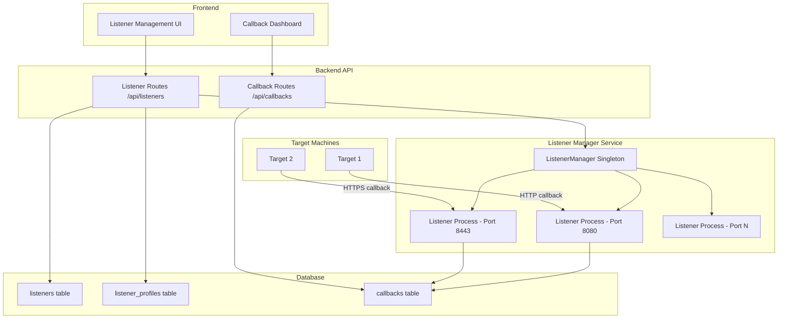
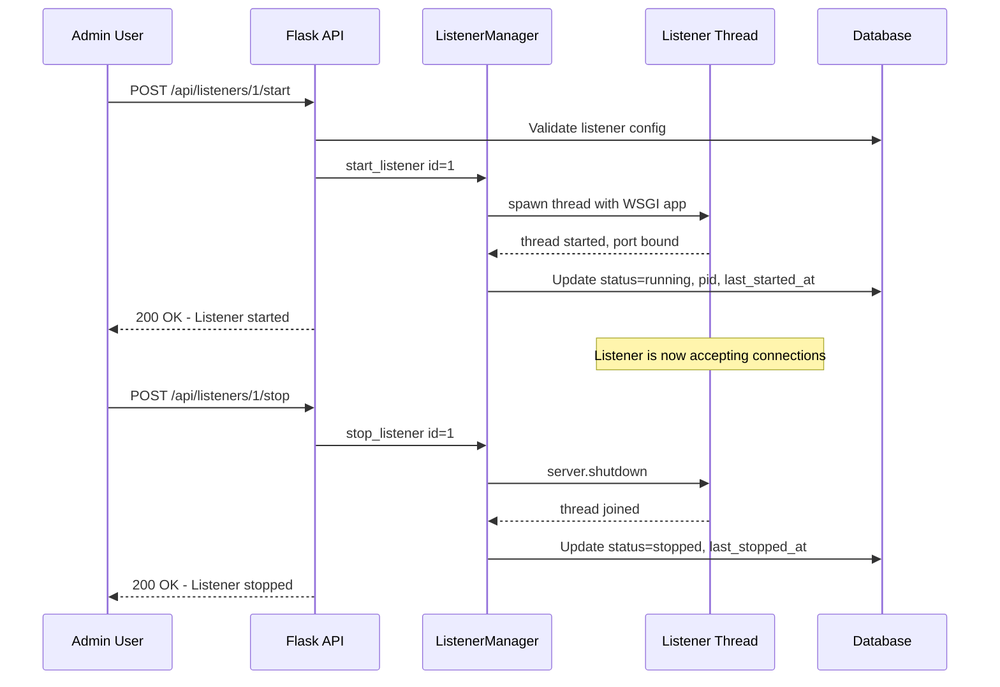

# Listener Architecture – MalSharePoint

## 1. Overview

MalSharePoint currently serves files via static raw endpoints and generates delivery one-liners, but lacks a proper **listener subsystem** — configurable HTTP/HTTPS servers that can be started, stopped, and monitored to receive callbacks from deployed payloads.

This document describes the architecture for adding listener management to MalSharePoint, covering:

- Database models for listener configuration and callback tracking
- A backend Listener Manager service for spawning/stopping listener processes
- API routes for CRUD operations and lifecycle control
- Callback/beacon check-in tracking
- Frontend UI for managing listeners
- Security considerations

---

## 2. Current State Analysis

| Component | What Exists Today | Gap |
|-----------|-------------------|-----|
| Raw file serving | [`serve_raw_file`](../backend/routes/files.py:199) on `/api/files/<id>/raw` | Runs on the main Flask port only; not configurable |
| Delivery commands | [`delivery_commands`](../backend/routes/files.py:242) generates one-liners | Hard-codes the base URL; no listener binding |
| Snippet hosting | [`get_raw_snippet`](../backend/routes/snippets.py:72) on `/api/snippets/<slug>/raw` | Same port as application; no isolation |
| Honeypot C2 endpoint | [`honeypot_c2`](../backend/app.py:47) on `/api/c2/checkin` | Static route, not a real listener; no callback tracking |
| Audit logging | [`AuditLog`](../backend/models.py:112) model with IP, action, target | Logs raw_fetch but no structured callback/beacon data |

---

## 3. High-Level Architecture



---

## 4. Database Models

### 4.1 `Listener` model

Stores the configuration for each listener instance.

| Column | Type | Description |
|--------|------|-------------|
| `id` | Integer, PK | Auto-increment |
| `name` | String 128, unique | Human-readable name, e.g. *HTTP-8080* |
| `listener_type` | String 32 | `http` or `https` |
| `bind_address` | String 45 | IP to bind, default `0.0.0.0` |
| `bind_port` | Integer | Port number |
| `status` | String 20 | `stopped`, `starting`, `running`, `error` |
| `tls_cert_path` | String 512, nullable | Path to TLS certificate for HTTPS |
| `tls_key_path` | String 512, nullable | Path to TLS private key for HTTPS |
| `profile_id` | Integer, FK | References `listener_profiles.id` |
| `created_by` | Integer, FK | References `users.id` |
| `pid` | Integer, nullable | OS process ID when running |
| `last_started_at` | DateTime, nullable | |
| `last_stopped_at` | DateTime, nullable | |
| `created_at` | DateTime | Auto-set UTC |
| `error_message` | Text, nullable | Last error if status is `error` |

### 4.2 `ListenerProfile` model

Defines HTTP response characteristics to make listeners look like legitimate web servers.

| Column | Type | Description |
|--------|------|-------------|
| `id` | Integer, PK | Auto-increment |
| `name` | String 128, unique | e.g. *Apache Default*, *IIS 10*, *Nginx* |
| `description` | Text | |
| `server_header` | String 256 | Value for the `Server` response header |
| `custom_headers` | Text/JSON | Additional response headers as JSON object |
| `default_response_body` | Text | HTML returned for unrecognized paths, e.g. a 404 page |
| `default_content_type` | String 128 | Default `Content-Type`, e.g. `text/html` |
| `created_by` | Integer, FK | References `users.id` |
| `created_at` | DateTime | |

### 4.3 `Callback` model

Tracks every inbound request to a listener from a target machine.

| Column | Type | Description |
|--------|------|-------------|
| `id` | Integer, PK | Auto-increment |
| `listener_id` | Integer, FK | References `listeners.id` |
| `source_ip` | String 45 | Remote IP |
| `source_port` | Integer | Remote port |
| `hostname` | String 256, nullable | Extracted from User-Agent or payload header |
| `user_agent` | String 512 | |
| `request_method` | String 10 | GET, POST, etc. |
| `request_path` | String 1024 | |
| `request_headers` | Text/JSON | All request headers as JSON |
| `request_body` | Text, nullable | POST body if present |
| `file_id` | Integer, FK, nullable | If the callback was triggered by a known payload |
| `timestamp` | DateTime | Auto-set UTC |
| `metadata` | Text/JSON, nullable | Parsed beacon data: OS, username, PID, etc. |

---

## 5. Listener Manager Service

The [`ListenerManager`] is a **singleton** instantiated at app startup in [`create_app`](../backend/app.py:15). It manages listener threads/processes.

### 5.1 Design Approach: Threading with Werkzeug

Each listener runs as a **`threading.Thread`** hosting a lightweight WSGI app via `werkzeug.serving.make_server`. This avoids forking entirely new Flask apps while keeping listeners isolated from the main API port.



### 5.2 Listener WSGI App

Each listener thread runs a minimal WSGI application that:

1. Checks if the request path matches a known file raw URL pattern, e.g. `/payload` or `/<file_id>/raw`
2. If matched: serves the file and logs a [`Callback`] record
3. If unmatched: returns the profile default response body with appropriate headers
4. Always records a [`Callback`] entry for every inbound request

### 5.3 Key Methods

| Method | Description |
|--------|-------------|
| `start_listener(listener_id)` | Reads config from DB, validates port availability, spawns thread, updates status |
| `stop_listener(listener_id)` | Signals shutdown to the WSGI server, joins thread, updates status |
| `restart_listener(listener_id)` | Calls stop then start |
| `get_status(listener_id)` | Returns current in-memory status and thread health |
| `auto_start()` | Called on app boot; starts all listeners whose saved status was `running` |
| `shutdown_all()` | Called on app teardown; gracefully stops all active listeners |

### 5.4 Port Conflict Detection

Before binding, the manager checks:
- Port is not already used by another MalSharePoint listener
- Port is not the main Flask port from config, default `5005`
- Port is available on the OS via a quick `socket.bind` test

---

## 6. API Routes

New blueprint: `listeners_bp` at `/api/listeners`, admin-only.

### 6.1 Listener CRUD

| Method | Path | Description |
|--------|------|-------------|
| `GET` | `/api/listeners` | List all listeners with status |
| `POST` | `/api/listeners` | Create a new listener |
| `GET` | `/api/listeners/<id>` | Get listener details |
| `PUT` | `/api/listeners/<id>` | Update listener config; must be stopped |
| `DELETE` | `/api/listeners/<id>` | Delete listener; must be stopped |

### 6.2 Lifecycle Control

| Method | Path | Description |
|--------|------|-------------|
| `POST` | `/api/listeners/<id>/start` | Start the listener |
| `POST` | `/api/listeners/<id>/stop` | Stop the listener |
| `POST` | `/api/listeners/<id>/restart` | Restart the listener |

### 6.3 Listener Profiles

| Method | Path | Description |
|--------|------|-------------|
| `GET` | `/api/listeners/profiles` | List all profiles |
| `POST` | `/api/listeners/profiles` | Create profile |
| `PUT` | `/api/listeners/profiles/<id>` | Update profile |
| `DELETE` | `/api/listeners/profiles/<id>` | Delete profile |

### 6.4 Callbacks

| Method | Path | Description |
|--------|------|-------------|
| `GET` | `/api/callbacks` | List callbacks, paginated, filterable by listener_id |
| `GET` | `/api/callbacks/<id>` | Get full callback details including headers and body |
| `DELETE` | `/api/callbacks` | Bulk delete callbacks older than N days |

---

## 7. Integration with Existing Systems

### 7.1 Payload Delivery Commands

The existing [`delivery_commands`](../backend/routes/files.py:242) endpoint currently derives `base_url` from the request headers. With listeners, this should be updated to:

- Accept an optional `listener_id` query parameter
- When provided, build `raw_url` using the listener bind address and port instead of the main app URL
- Fall back to current behavior when no listener is specified

### 7.2 Audit Logging

All listener events feed into the existing [`AuditLog`](../backend/models.py:112) system:

| Action | Trigger |
|--------|---------|
| `listener_start` | Listener started |
| `listener_stop` | Listener stopped |
| `listener_error` | Listener failed to start or crashed |
| `listener_callback` | Inbound request received; also written to `callbacks` table |

### 7.3 Linking Callbacks to Files

When a listener serves a file, the [`Callback`] record sets `file_id` to link back to the [`File`](../backend/models.py:55) model. This enables tracking which payloads have been fetched and from where.

---

## 8. Frontend Components

### 8.1 Listener Management Page

New route: `/listeners` — admin only.

| Section | Description |
|---------|-------------|
| Listener list | Table showing name, type, port, status with colored badge, callback count |
| Create/Edit dialog | Form for name, type, bind address, port, profile selection, TLS cert upload |
| Start/Stop controls | Inline buttons with confirmation modal for stop |
| Status indicator | Real-time polling every 5s or WebSocket for live status |

### 8.2 Callback Dashboard

New route: `/callbacks` — admin only.

| Section | Description |
|---------|-------------|
| Callback feed | Reverse-chronological list with source IP, path, user-agent, timestamp |
| Filters | By listener, time range, source IP, associated file |
| Detail drawer | Side panel showing full request headers, body, and parsed metadata |
| Statistics | Callback count per listener, unique IPs, timeline chart |

### 8.3 Integration Points

- **Dashboard**: Add listener count and active listener count to [`AdminDashboard`](../frontend/src/pages/admin/AdminDashboard.tsx:1) stats
- **PayloadDelivery**: Add listener selector dropdown to [`PayloadDelivery`](../frontend/src/pages/PayloadDelivery.tsx:104) page
- **Layout**: Add Listeners nav item to [`Layout`](../frontend/src/components/Layout.tsx:1) sidebar

---

## 9. Security Considerations

### 9.1 Access Control

- All listener management endpoints require `admin` role via the existing [`admin_required`](../backend/routes/admin.py:12) decorator
- Listener WSGI apps do NOT go through JWT authentication — they serve payloads to unauthenticated target machines
- Callback data visible only to admins

### 9.2 TLS for HTTPS Listeners

- Admin uploads cert + key files via the API
- Files stored in a configurable `CERTS_FOLDER`, not in the uploads directory
- Certificates validated before listener start: check PEM format, expiry, matching key
- Option to generate self-signed certs via a helper endpoint

### 9.3 Port Restrictions

- Block binding to ports below 1024 unless running as root, with a clear error message
- Block binding to the main application port, default 5005
- Maximum concurrent listeners configurable via [`ServerConfig`](../backend/models.py:135), default 10

### 9.4 Rate Limiting and Abuse Prevention

- Optional per-listener rate limit: max requests per minute from a single IP
- Configurable max request body size per listener
- Listeners do NOT proxy to the main Flask app — complete isolation

### 9.5 Logging Sensitivity

- Full request headers and bodies are stored; admins should be aware of storage implications
- Add a configurable retention period for callback records, default 30 days
- Callback body storage can be disabled per listener to save space

---

## 10. Configuration Additions

New entries for [`Config`](../backend/config.py:5):

```python
# Listener defaults
LISTENER_CERTS_FOLDER = os.path.abspath(os.environ.get('CERTS_FOLDER') or 'certs')
MAX_LISTENERS = int(os.environ.get('MAX_LISTENERS', 10))
LISTENER_AUTO_START = os.environ.get('LISTENER_AUTO_START', 'true').lower() == 'true'
CALLBACK_RETENTION_DAYS = int(os.environ.get('CALLBACK_RETENTION_DAYS', 30))
CALLBACK_MAX_BODY_SIZE = int(os.environ.get('CALLBACK_MAX_BODY_KB', 512)) * 1024
```

---

## 11. New Dependencies

| Package | Purpose |
|---------|---------|
| None required | Werkzeug is already a Flask dependency; `threading` and `ssl` are stdlib |

The listener threads use `werkzeug.serving.make_server` which is already installed as part of Flask. No additional packages are needed.

---

## 12. File Structure — New Files

```
backend/
├── listeners/
│   ├── __init__.py
│   ├── manager.py          # ListenerManager singleton
│   ├── wsgi_app.py          # WSGI app factory for listener threads
│   └── tls_utils.py         # TLS cert validation and self-signed generation
├── routes/
│   ├── listeners.py         # API routes for listener CRUD + lifecycle
│   └── callbacks.py         # API routes for callback viewing
├── certs/                   # TLS certificate storage; gitignored
frontend/src/
├── pages/
│   ├── admin/
│   │   ├── Listeners.tsx    # Listener management page
│   │   └── Callbacks.tsx    # Callback dashboard page
├── api/
│   └── listeners.ts         # API client for listeners + callbacks
```

---

## 13. Implementation Order

The following is the recommended implementation sequence:

1. **Database models** — Add `Listener`, `ListenerProfile`, `Callback` to [`models.py`](../backend/models.py:1) and run migration
2. **Listener Manager** — Implement `backend/listeners/manager.py` with start/stop/status
3. **Listener WSGI app** — Implement `backend/listeners/wsgi_app.py` for request handling and callback recording
4. **API routes** — Implement `backend/routes/listeners.py` and `backend/routes/callbacks.py`
5. **Integrate with app** — Register blueprints and initialize ListenerManager in [`create_app`](../backend/app.py:15)
6. **TLS support** — Implement `backend/listeners/tls_utils.py` and cert upload endpoint
7. **Update delivery commands** — Modify [`delivery_commands`](../backend/routes/files.py:242) to accept listener_id
8. **Seed default profiles** — Add Apache/IIS/Nginx profiles on first run
9. **Frontend: Listeners page** — Build listener management UI
10. **Frontend: Callbacks page** — Build callback dashboard
11. **Frontend: Integration** — Update nav, admin dashboard stats, and payload delivery page
12. **Testing** — Unit tests for manager, integration tests for API routes
